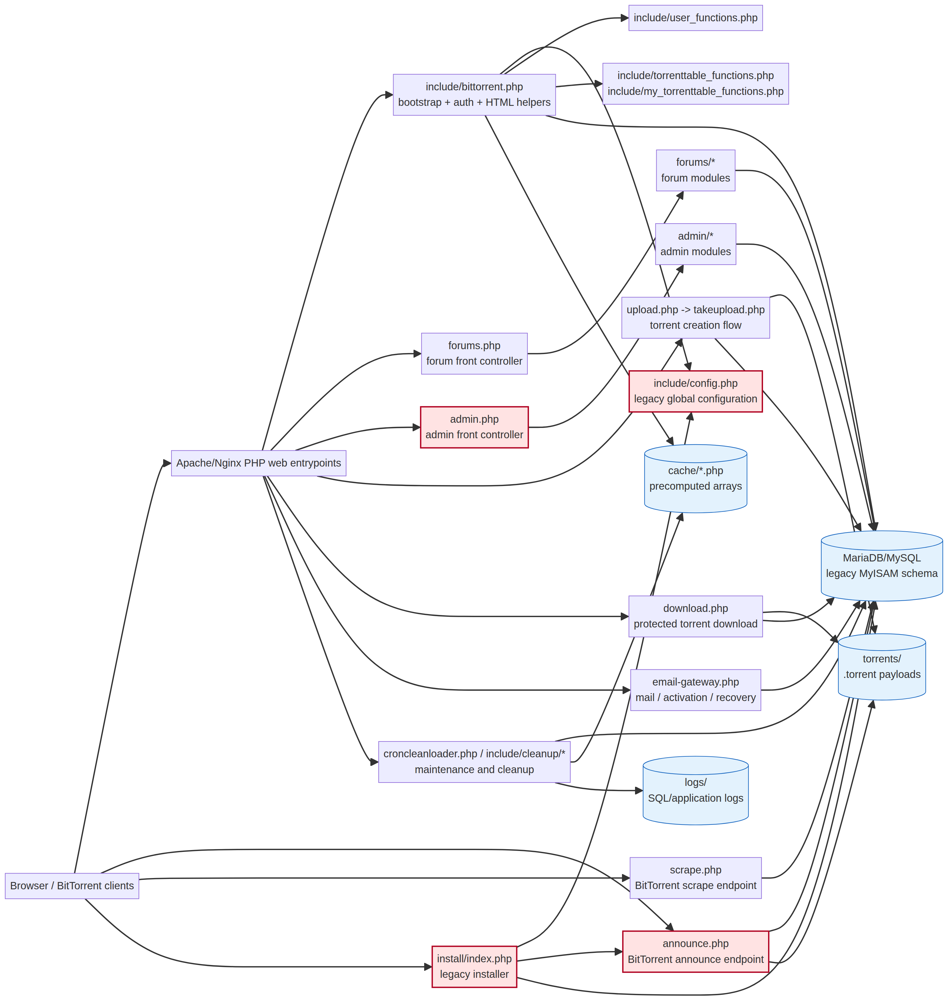

# Auditoria técnica do TBDev — branch `stg`

**Autor:** Manus AI
**Repositório:** [`kakadea/tbdev`](https://github.com/kakadea/tbdev)
**Branch analisada:** `stg`
**Commit analisado:** `965e99d8ee04668a9ce577b417986f36ac8613d6`
**Escopo:** leitura técnica completa da árvore versionada, análise estática de dependências, leitura integral dos nós críticos e geração de grafo. Nenhum arquivo do repositório foi alterado, nenhum commit foi criado e nenhum push foi realizado.

## 1. Resumo executivo

A branch `stg` é um snapshot antigo do **TBDev.net BitTorrent Tracker**, datado funcionalmente da geração de 2009–2011. A aplicação é um monólito PHP procedural com páginas independentes, includes compartilhados, conexão direta ao MySQL/MariaDB, armazenamento de arquivos `.torrent` em disco e um endpoint separado para o protocolo BitTorrent. O repositório não contém framework moderno, `composer.json`, testes automatizados ou uma camada de configuração segura.

A base tem valor como ponto de partida funcional e histórico, mas **não deve ser publicada diretamente no VPS de produção**. Há incompatibilidades importantes com PHP moderno, credenciais e parâmetros sensíveis mantidos no código de configuração, autenticação baseada em MD5, ausência aparente de proteção CSRF, SQL construído manualmente e um instalador web capaz de recriar o banco e sobrescrever arquivos. Também foram encontrados dois problemas estruturais no snapshot: `include/cache_functions.php` é requerido pela homepage, mas não existe na árvore versionada, e `include/cleanup.php` contém uma declaração de função sintaticamente inválida.

A recomendação é tratar `stg` como **base de laboratório**. O próximo trabalho deve ser uma modernização incremental em branch própria, começando por congelar o legado, documentar o schema, separar configuração/segredos, substituir a extensão `mysql_*`, bloquear/remover o instalador público e criar testes de fumaça antes de qualquer migração de dados.

## 2. Inventário da árvore

Todos os arquivos versionados foram catalogados, tiveram tamanho/linhas/hash registrados e foram incluídos na análise estática. A cópia local está em modo destacado apontando para o commit da branch `stg`; a `master` não foi alterada.

| Métrica | Resultado |
|---|---:|
| Arquivos rastreados | 241 |
| Arquivos PHP | 205 |
| Arquivos SQL | 9 |
| Arquivos `.htaccess` | 8 |
| Linhas PHP aproximadas | 28.147 |
| Tamanho do checkout | 5,2 MB |
| Relações de include identificadas | 175 |
| Includes dinâmicos/não resolvidos | 35 |
| Arquivos com referências SQL | 123 |
| Arquivos com entradas HTTP/cookies/arquivos | 83 |
| Diferença entre `stg` e `origin/master` | Nenhuma no commit analisado |

A maior parte do código está concentrada no PHP procedural. Os diretórios principais ativos são `admin/`, `forums/`, `include/`, `lang/`, `cache/`, `torrents/` e `logs/`; `captcha/` mantém os endpoints de desafio usados opcionalmente por autenticação, enquanto o payload JavaIRC foi removido. Na raiz ficam os front controllers e handlers de upload, download, login, mensagens, usuários e protocolo do tracker.

## 3. Grafo de arquitetura

O grafo mostra os dois caminhos principais da aplicação. O caminho web passa pelo bootstrap compartilhado `include/bittorrent.php`; o caminho de BitTorrent passa por `announce.php` e `scrape.php`, que fazem bootstrap próprio e acessam o banco diretamente.

O arquivo Mermaid editável está disponível em [`tbdev-architecture.mmd`](tbdev-architecture.mmd). O grafo é uma representação arquitetural baseada na árvore e nos includes encontrados; não é uma afirmação de que todos os módulos estejam completos ou prontos para execução.

## 4. Fluxos principais

### 4.1. Bootstrap web e autenticação

A maioria das páginas web carrega `include/bittorrent.php`. Esse arquivo inclui a configuração global, abre conexão MySQL com `mysql_connect()`, seleciona o banco e chama `userlogin()`. A autenticação depende de cookies persistentes contendo identificador do usuário, hash da senha e uma verificação derivada do IP. O login em `takelogin.php` consulta `users`, calcula novamente o hash legado e chama `logincookie()`.

A conta é identificada por `username`; o schema guarda `passhash`, `secret`, `passkey`, `editsecret`, estado, classe, e os contadores de upload/download. As classes vão de usuário comum até SysOp. O header da aplicação exibe recursos diferentes conforme a classe; a área administrativa é roteada por `admin.php` e exige classe de moderador ou superior.

### 4.2. Tracker BitTorrent

`announce.php` é um endpoint autônomo. Ele não carrega o bootstrap web comum nem `include/config.php`; declara novamente conexão, parâmetros de announce e base URL. O cliente precisa fornecer uma `passkey`, `info_hash`, `peer_id`, porta e contadores. O endpoint valida o pedido, identifica o usuário pela passkey, localiza o torrent pelo info-hash, retorna peers em formato compacto bencoded e atualiza `peers`, `users` e `torrents`.

O fluxo trata eventos `started`, `completed` e `stopped`, calcula se o cliente é seeder pelo campo `left`, aplica limites de conexão por passkey e incrementa contadores de seeders/leechers. O endpoint recusa requisições com sinais de navegador e exige modo compacto. `scrape.php` é o endpoint auxiliar, com bootstrap ainda menor, que devolve seeders, leechers e completions para info-hashes.

### 4.3. Upload, armazenamento e download

`upload.php` apresenta o formulário para usuários com classe de uploader ou superior. `takeupload.php` recebe o multipart, valida nome e extensão `.torrent`, decodifica bencode, remove capacidade de multi-tracker/nodes, valida `announce`, calcula o SHA-1 do dicionário `info`, grava metadados na tabela `torrents`, lista de arquivos na tabela `files` e move o arquivo para `torrents/<id>.torrent`. Também tenta regenerar feeds RSS e grava um log de site.

`download.php` exige login, localiza o torrent pelo ID, verifica se o arquivo existe e é legível, incrementa `hits`, gera uma passkey se necessário, reescreve a URL de announce dentro do `.torrent` e entrega o arquivo bencoded ao cliente. O diretório de torrents precisa ser gravável pelo usuário do servidor web.

### 4.4. Homepage e cache

`index.php` é a homepage autenticada. Ela chama `dbconn(true)`, o que registra limpeza automática no shutdown, requer `include/cache_functions.php` e tenta usar Memcache em `localhost:11211` para estatísticas e notícias. A árvore da branch não contém `include/cache_functions.php`, embora a homepage o requeira e chame `tbdev_cache_connect()`, `getCache()` e `setCache()`. Essa dependência ausente precisa ser localizada em outro pacote/versão ou reimplementada antes de executar a branch literalmente.

### 4.5. Fóruns, mensagens e perfis

`forums.php` funciona como front controller do subsistema de fóruns. O parâmetro `action` encaminha para módulos de visualização de fórum/tópico, resposta, novo tópico, pesquisa, mensagens não lidas e operações de moderador. As tabelas principais são `forums`, `topics`, `posts`, `readposts` e `users`.

`messages.php` implementa caixas de entrada, envio, salvamento, encaminhamento, pastas e exclusão, usando `messages`, `pmboxes`, `friends`, `blocks` e `users`. `userdetails.php`, `friends.php`, `reputation.php` e `userhistory.php` formam o restante do subsistema social.

### 4.6. Administração e manutenção

`admin.php` faz o roteamento para bans, criação/exclusão de usuários, estatísticas, categorias, regras, notícias, logs, fóruns, limpeza manual e consultas de status do MySQL. Os módulos administrativos fazem muitas operações de escrita diretamente nas tabelas.

`include/cleanup.php` é o núcleo de manutenção automática. Ele tenta reconciliar arquivos `.torrent` e registros, remover peers antigos, esconder torrents inativos, eliminar contas pendentes/inativas, atualizar contadores, promover/demover usuários, recalcular fóruns, apagar torrents antigos e limpar mensagens/leituras expiradas. Há uma declaração `function deadtime {` sem parênteses, que é sintaticamente inválida; essa rotina precisa ser corrigida antes de ser usada.

## 5. Modelo de dados

O schema principal cria tabelas MyISAM para usuários, torrents, peers, arquivos, fóruns, mensagens, reputação, categorias, regras, limpeza, logs e configurações auxiliares. Não há foreign keys declaradas no SQL; as relações são mantidas por convenção e por código procedural.

| Domínio | Tabelas principais | Papel |
|---|---|---|
| Identidade | `users`, `bans`, `friends`, `blocks` | Contas, classes, bloqueios e relações sociais |
| Tracker | `torrents`, `peers`, `files`, `categories` | Metadados, peers, conteúdo `.torrent` e categorias |
| Fóruns | `forums`, `topics`, `posts`, `readposts` | Discussões e controle de leitura |
| Mensagens | `messages`, `pmboxes` | Caixas, mensagens e pastas |
| Reputação | `reputation`, `reputationlevel` | Pontos e níveis |
| Conteúdo | `news`, `rules`, `rules_categories`, `stylesheets` | Notícias, regras e aparência |
| Operação | `cleanup`, `cleanup_log`, `sitelog`, `avps`, `searchcloud` | Limpeza, logs, estatísticas e cache auxiliar |

O uso de MyISAM significa ausência de transações e de integridade referencial no nível do banco. Isso é particularmente sensível no fluxo de announce, limpeza e exclusão de torrents, porque falhas entre operações podem deixar registros órfãos ou contadores inconsistentes.

## 6. Achados críticos

### 6.1. Bloqueador de runtime

A aplicação depende intensamente de `mysql_*`, removido do PHP moderno, e o instalador também verifica a antiga extensão `mysql`. O snapshot foi projetado para PHP 5.x. Não se deve tentar resolver isso trocando o PHP global do usuário `cloud` ou alterando a versão usada por Nextcloud/Capital; a migração deve ser isolada em ambiente de teste.

### 6.2. Configuração e segredos

`include/config.php` e o bootstrap independente de `announce.php` mantêm parâmetros de conexão e chaves da aplicação no código. Os valores observados no snapshot foram omitidos deste relatório. Na modernização, a configuração deve vir de arquivo fora do webroot ou de variáveis de ambiente com permissões restritas, e a conexão deve usar um usuário MariaDB dedicado com privilégios mínimos. O usuário `root` do banco não deve ser usado pela aplicação.

### 6.3. Criptografia de senhas obsoleta

A senha é processada com uma composição baseada em MD5 e salt curto/legado. Isso não deve ser simplesmente “melhorado” de uma vez em produção, pois quebraria contas existentes. O caminho seguro é criar uma camada de compatibilidade para login, migrar cada conta para `password_hash()` após login bem-sucedido ou reset voluntário e eliminar progressivamente o formato antigo.

### 6.4. SQL manual e superfícies de entrada

Há centenas de consultas construídas por concatenação. Vários IDs são convertidos para inteiro e alguns textos passam por escape manual, mas o padrão geral não oferece a segurança e a auditabilidade de prepared statements. Também há entradas de `GET`, `POST`, `REQUEST`, cookies, uploads e cabeçalhos HTTP. A migração deve priorizar autenticação, administração, upload, mensagens e endpoints de announce.

### 6.5. Sessão e cookies

O login usa cookies persistentes próprios, com prefixo configurável e hash de sessão derivado do passhash/IP. A base não mostra uma estratégia moderna de rotação de sessão, SameSite explícito ou expiração curta. A camada nova deve usar cookies `Secure`, `HttpOnly`, `SameSite=Lax` ou `Strict` conforme o fluxo, regeneração de sessão após login e invalidação no logout.

### 6.6. Instalador destrutivo exposto

O instalador web legado foi removido do checkout executável. A análise histórica mostrou que `install/index.php` aceitava parâmetros web, podia criar banco, apagar tabelas existentes, sobrescrever `include/config.php` e `announce.php`, criar a conta SysOp com hash legado e depender de um lock removível. A instalação agora deve ocorrer somente por configuração de ambiente, schema SQL versionado e migrações explícitas, aplicados em banco descartável ou mediante procedimento de backup e aprovação.

### 6.7. Upload e arquivos

O upload valida extensão, bencode e tamanho, mas grava dados em diretório que precisa ser gravável pelo webserver e aceita NFO. A modernização deve reforçar limites de request, MIME/estrutura, nomes, armazenamento fora do webroot quando possível, permissões, quotas e proteção contra arquivos inesperados. O download deve continuar entregando apenas IDs e arquivos validados.

### 6.8. Cache e dependências incompletas

A homepage depende de Memcache, mas a biblioteca correspondente não está versionada. Antes de escolher entre Memcache, Redis ou cache local, é preciso localizar a versão esperada ou remover a dependência e medir o comportamento. Não devemos instalar um novo serviço apenas para compensar uma referência quebrada sem entender a origem do snapshot.

### 6.9. Erros e observabilidade

Há uso de `error_reporting(0)`, mensagens de erro diretamente derivadas do MySQL e logs em arquivos locais. O estado de erro deve ser separado entre mensagem pública genérica e log interno protegido. A aplicação precisa de logs estruturados, rotação e métricas para announce, erros de banco, uploads, fila de limpeza e latência.

## 7. O que não fazer ainda

Não publicar esta branch diretamente no domínio produtivo, não aplicar schema ou migrações no MariaDB real sem backup e aprovação, não trocar a versão PHP global do usuário `cloud`, não conceder acesso de banco como root e não ativar o cleanup antes de corrigir e testar a função `deadtime` e as rotinas destrutivas.

Também não devemos fazer uma “modernização” que reescreva todos os 205 arquivos de uma vez. Isso dificultaria rollback e poderia alterar contabilidade de peers, passkeys, ratio, permissões ou mensagens sem perceber.

## 8. Plano recomendado de evolução

| Fase | Resultado | Proteção |
|---|---|---|
| 1. Congelamento | Tag/backup do snapshot `stg`, documentação do schema e inventário de rotas | Nenhuma mudança em produção |
| 2. Ambiente isolado | Compose de laboratório com PHP compatível, MariaDB separado e domínio de teste | Dados fictícios, sem conexão ao banco produtivo |
| 3. Runtime | Substituição gradual de `mysql_*` por PDO/mysqli e correção de sintaxe | Testes de fumaça por módulo |
| 4. Segurança | Segredos externos, usuário DB mínimo, headers, sessão, CSRF, upload e installer removido | Auditoria antes do deploy |
| 5. Compatibilidade | Camada de login que aceita hash antigo e migra contas após autenticação | Rollback por conta/feature flag |
| 6. Tracker | Testes de announce/scrape, bencode, peers e contabilidade | Fixtures e banco de teste |
| 7. Deploy | Branch de release, backup do banco/arquivos e janela de mudança | Nginx `-t`, smoke tests e rollback documentado |

A primeira alteração prática que faz sentido na branch de trabalho é **não** uma grande reescrita: é criar documentação, testes mínimos e uma camada de configuração segura. Em seguida, corrigimos os dois bloqueadores óbvios — a referência ausente de cache e a sintaxe do cleanup — dentro de um ambiente de laboratório.

## 9. Artefatos da auditoria

Os artefatos gerados durante a análise são:

| Arquivo | Conteúdo |
|---|---|
| `tbdev-architecture.png` | Grafo renderizado da arquitetura |
| `tbdev-architecture.mmd` | Fonte Mermaid editável |
| `inventory.txt` | Inventário por extensão e tamanho |
| `complete-inventory.tsv` | Cada arquivo versionado, linhas e SHA-256 |
| `dependency-edges.tsv` | Includes resolvidos entre arquivos |
| `dynamic-includes.tsv` | Includes não resolvidos/dinâmicos |
| `tables-by-file.tsv` | Referências de tabelas por arquivo |
| `request-inputs.tsv` | Entradas HTTP identificadas por arquivo |
| `risk-findings.txt` | Indicadores estáticos de obsolescência e risco |
| `graph-validation.md` | Achados usados na validação do grafo |

## Referências

[1]: https://github.com/kakadea/tbdev "Repositório público kakadea/tbdev"
[2]: https://github.com/kakadea/tbdev/tree/stg "Branch stg do repositório TBDev"
[3]: https://www.php.net/manual/en/function.password-hash.php "PHP password_hash()"
[4]: https://www.php.net/manual/en/book.pdo.php "PHP Data Objects (PDO)"
